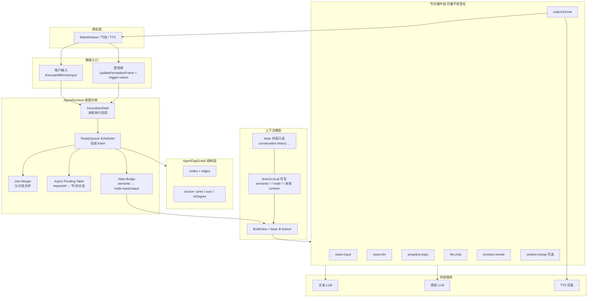
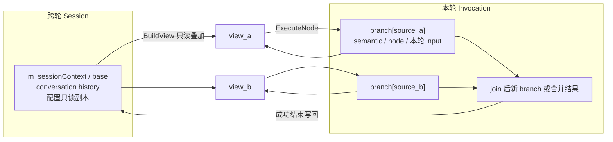
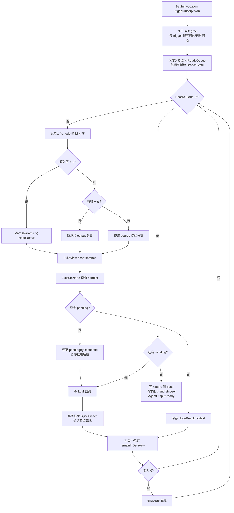
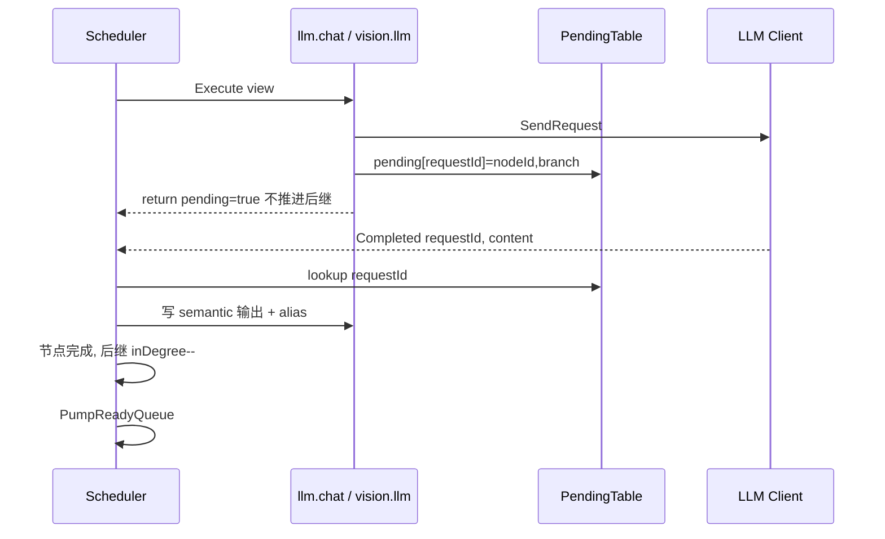
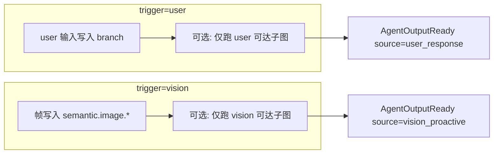
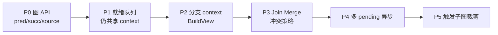

# Branched DAG Runtime 架构说明

> Pet Agent 调度内核演进方案：在现有代码上演进，不是推倒重来。

---

## 1. 一句话目标

把「**一次全局拓扑序 + 单一共享黑板**」换成
「**按源点分叉 → 在线就绪调度 → join 显式合并 → 异步多挂起**」，
节点仍读写 `semantic.*`，**隔离与合并全部由 Runtime 负责**。

---

## 2. 逻辑分层总览



---

## 3. 核心设计思想（四条）

| 原则 | 含义 |
| --- | --- |
| **边 = 控制依赖** | 谁必须先于谁，由 DAG 边决定 |
| **分支上下文 = 数据隔离** | 每个源点一条执行线，线内私有可写层，禁止同层抢写全局黑板 |
| **Join = 唯一合并点** | 入度 > 1 时才合并父产出；冲突必须有策略，禁止静默覆盖 |
| **节点无感知调度** | 节点仍是 `Execute(node, context, err)`；分叉/合并/挂起在 Runtime |

---

## 4. 上下文模型



### 读写顺序（节点眼里的 context）

1. 先看 `branch.local`
2. 再回退 `base`
3. 节点写出的增量只回写 `branch.local`
4. 只有 invocation 成功结束，才把需要持久化的结果（如 history）写回 `base`

### key 分层（沿用现有协议）

| 层 | 放哪 | 例 |
| --- | --- | --- |
| 持久共享 | base | `conversation.history` |
| 本轮语义 | branch | `semantic.text.*` `semantic.vision.*` |
| 端口桥接 | branch | `node.input.*` `node.output.*` |
| 模块私有 | branch | `llm.*` `emotion.*` `vision.*` |
| 调度状态 | Invocation / Runtime 表 | `runtime.async.*` 改为表结构，不进业务判断 |

---

## 5. 在线拓扑 + 分叉合并执行流



### 和「先拓扑再扫一遍」的差别

| 旧 | 新 |
| --- | --- |
| 加载时固定一个全序 | 运行时按就绪动态推进 |
| 同层顺序由 Kahn 入队偶然决定且共享写 | 同层在不同 branch，写不冲突；join 才相遇 |
| 异步单槽 + resume index | 异步按 requestId 绑节点/分支，回调后继续减入度 |

---

## 6. 复杂图数据流示例

```mermaid
flowchart TB
  U["source: user_prompt<br/>branch U"] --> Chat1["llm.chat"]
  V["source: vision_input<br/>branch V"] --> VL["vision.llm"]
  VL --> PT["proactive.topic"]
  Chat1 --> J["join / context.merge"]
  PT --> J
  J --> Emo["emotion.rewrite"]
  Emo --> Out["output.format"]

  style U fill:#2d4a3e
  style V fill:#2d3a4a
  style J fill:#4a3d2d
```



- `U` 与 `V` 并行语义上隔离：各写各的 `semantic.*`
- 到 `J` 才合并；若两边都产出 `semantic.text.response`，必须：
  - `prefer_user` / `prefer_vision` / `concat`，或
  - 报错要求用户加 `context.merge` 规则
- **禁止**「后执行的覆盖先执行的」

---

## 7. 异步模型



要点：

- 全局不再只有一个 `m_pendingRequestId`
- 同一 invocation 内可挂多个异步节点（真正并行可后做，先做到不互踩）
- 新一轮 user/vision 在旧 invocation 未结束时可拒绝或排队

---

## 8. 模块职责与文件映射

```text
AgentDagGraph          结构：load / 环检测 / source / pred / succ / inDegree
AgentContext           键值容器 + 可选 Copy/Diff/Merge 辅助
InvocationState        本轮：ready 队列、分支、NodeResult、pending 表
AgentRuntime           唯一编排者：分叉、调度、合并、异步、alias、输出信号
Node handlers          业务纯逻辑：读 semantic/node.input，写产出
Protocol 文档          规定 base/branch/join/async 表语义
agent_dag_structure    默认单链兼容；复杂图再加多源与 merge
```

| 组件 | 现状 | 目标 |
| --- | --- | --- |
| `AgentDagGraph` | 拓扑序 + 节点查询 | + 邻接反查、源点、运行时入度拷贝 |
| `AgentRuntime::ExecuteFromIndex` | 线性扫序 | `PumpReadyQueue` 在线调度 |
| `m_context` | 全局黑板 | 拆成 `session base` + `invocation branches` |
| `runtime.async.*` 单槽 | 一处挂起 | `pendingByRequestId` |
| 节点 | 已按协议写 key | 尽量零改动 |

---

## 9. Join 合并策略（架构约束）

```text
Merge(parents[]):
  out = empty branch
  for each parent output:
    for each key in parent.produced 或 branch 可写层:
      if key not in out: copy
      else if same value: keep
      else: apply rule(key) or fail
  return out
```

规则来源优先级：

1. 专用 `context.merge` 节点 config
2. 边级 `map`（二期可加）
3. 全局默认：冲突失败（开发期最安全）

---

## 10. 触发与子图（双模）



- `runtime.trigger.type` 仍只表示**本轮**来源，结束即清
- 复杂「用户+视觉同一张大图」时：要么分两轮 invocation，要么一张图双源 + join（由配置决定）

---

## 11. 端到端思路串起来

1. **配置定义能力图**（自由度）：用户用 JSON 拼节点与边。
2. **加载只校验结构**（有向无环、端点合法）；执行期用入度表在线推进。
3. **每个源点一条数据宇宙**（branch），消除同层写冲突。
4. **节点只做功能**（LLM / 情感 / 主动话题 / 输出），通过 `semantic.*` 协议插拔。
5. **扇入必须显式合并**，冲突可见、可配置。
6. **异步是调度状态机的一部分**，不是全局一个 bool。
7. **UI 只听最终 `semantic.text.final` + source**，不关心图多复杂。

---

## 12. 与当前默认 DAG 的兼容

当前单链：

```text
user_input ───────────────────────────────────────────────┐
                                                          ▼
vision_input → vision_llm → proactive_topic → call_llm → emotion_rewrite → format_output
```

在新架构下：

- 只有一个 source → 只有一个 branch
- 无 join → Merge 从不触发
- 行为应与现网一致

用户输入排队保持 FIFO；视觉触发排队采用 latest-wins，重复编码帧由 `semantic.vision.frame_hash` 过滤。

复杂图能力是**加出来的**，不是默认路径上的负担。

---

## 13. 落地顺序（架构演进路径）



每一步都应：**默认单链回归通过** 再开下一刀。

---

## 14. 架构判据（什么叫做对了）

- 双源写不同 key：结果稳定、无覆盖
- 双源写同 key 无规则：加载或运行时明确失败
- 多异步回调：不会清错 pending、不会跳过后继
- 任意合法拓扑：只要边完整 + join 有规则，结果与「并行等价」一致（同层不再依赖偶然顺序）
- 节点插件无需知道自己在哪条 branch

---

## 总结

这是一个 **「图结构可配置 + 运行时分支隔离 + join 显式合并」的 DAG Agent 内核**；
自由度在配置与节点插件，正确性在 Runtime 的调度与上下文模型。
