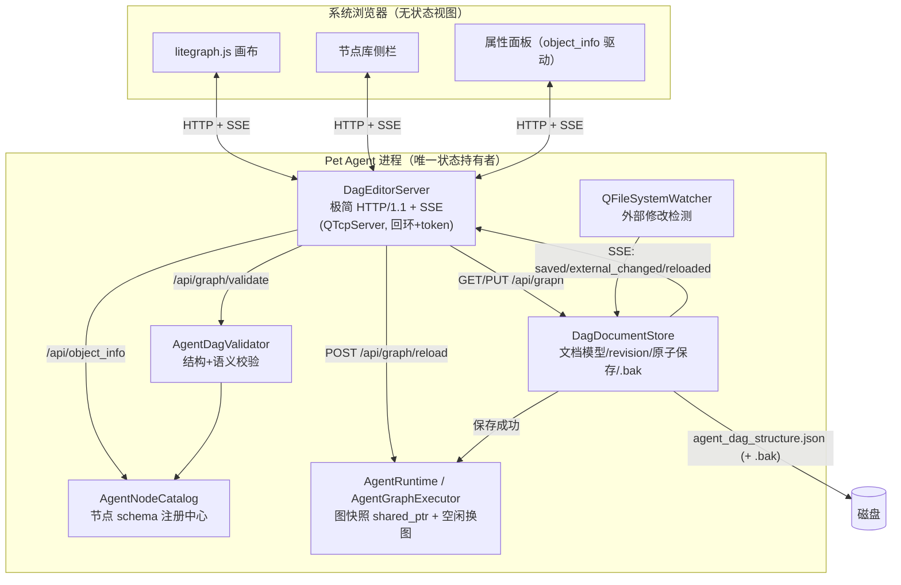

# DAG 图形化编辑器（ComfyUI 风格 Web UI）实施计划

> 目标：为 `agent_dag_structure.json` 提供一个类似 ComfyUI WebUI 的图形化配置方式——
> 节点画布、拖拽连线、节点库、属性面板、保存校验，并以此为契机把 **DAG 热重载**
> 提前纳入运行时改造。本文是实施计划，不是已完成设计；所有文件路径均对应当前仓库真实代码。

---

## 0. 决策记录（已确认）

| 决策点 | 结论 | 备注 |
| --- | --- | --- |
| 技术路线 | **应用内嵌本地 HTTP 服务 + 系统浏览器打开 Web 编辑器** | 为热重载与后续远程监控预留干净的 API 边界 |
| 布局元数据存储 | **同一个 `agent_dag_structure.json`，新增可选 `editor` 字段** | 单文件可分享，最接近 ComfyUI 工作流文件习惯 |
| 热重载 | **一等公民，前置改造**（里程碑 M1） | 运行时改为图快照 + 空闲门控换图 |
| HTTP 实现 | **基于 `QTcpServer` 自建极简 HTTP/1.1 层** | 本机 Qt 6.9.2 MinGW 安装未包含 `Qt6HttpServer`/`Qt6WebSockets`（已核实 `E:\Qt\6.9.2\mingw_64`），自建零新增依赖，符合瘦身目标 |

---

## 1. 现状盘点

### 1.1 当前配置链路

```text
main.cpp: FindAgentDagConfigPath()
    └─ AgentRuntime::Start(agentDagConfigPath)          [include/vpet/agent/agent_runtime.h]
         └─ AgentGraphExecutor::Load(configPath)        [src/agent/agent_graph_executor.cpp]
              └─ AgentDagGraph::LoadFromJsonFile(...)   [src/agent/agent_dag_graph.cpp]
                   解析 nodes/edges → 校验重复边/自环/环检测 → 拓扑排序
```

痛点：

1. 配置修改需要重启应用，没有动态生效路径。
2. JSON 手工编辑无即时校验反馈，错误只在启动日志里出现（`qWarning`）。
3. 没有节点类型/参数的机器可读 schema，编辑器与文档只能靠人肉同步。

### 1.2 相关现有组件

| 组件 | 位置 | 与本计划的关系 |
| --- | --- | --- |
| `AgentDagGraph` | `include/vpet/agent/agent_dag_graph.h` | 结构层：解析/环检测/拓扑序。**只读取根对象 `nodes`/`edges` 字段，天然忽略未知字段**（已在 `LoadFromJsonData` 核实），因此可以安全追加 `editor` 扩展字段而不改它 |
| `AgentGraphExecutor` | `include/vpet/agent/agent_graph_executor.h` | 按值持有 `AgentDagGraph m_dagGraph`，启动时 `Load()` 一次。**热重载的核心改造对象** |
| `AgentNodeRegistry` | `include/vpet/agent/agent_node_registry.h` | type→handler 分发，等价 ComfyUI 的 `NODE_CLASS_MAPPINGS` |
| 节点类型常量 | `include/vpet/agent/agent_context_keys.h`（10 个 `NODE_TYPE_*`） | 节点目录的权威清单来源 |
| 各节点 config 读取逻辑 | `src/agent/agent_runtime_nodes.cpp` 及各 node 文件 | schema 提炼的事实来源（见 M0） |
| `InvocationQueuePolicy` | `include/vpet/agent/invocation_queue_policy.h`（`IsEmpty()`） | 热重载空闲判定的输入之一 |
| 右键菜单 / 对话框模式 | `src/main_window.cpp` `ShowPetContextMenu()`（~L730）、`MemoryManagerDialog` 成员缓存（~L876） | 编辑器入口照此模式挂菜单项 |
| 端口探测先例 | `src/tts_server_manager.cpp`（`QTcpServer probe`） | 本地服务端口策略可参考 |
| 测试注册模式 | `CMakeLists.txt` `BUILD_TESTING` 块 + `scripts/Run-Tests.ps1` | 新测试目标按现有 per-target 模式追加 |

### 1.3 默认 DAG 与节点类型（目录必须覆盖）

```text
user.input -> web.research -> memory.retrieve -> llm.chat -> emotion.rewrite -> output.format -> memory.store
vision.input -> vision.llm -> proactive.topic ------------------------------------------------------^ (join)
```

10 个类型：`user.input` `vision.input` `vision.llm` `proactive.topic` `web.research`
`llm.chat` `memory.retrieve` `memory.store` `emotion.rewrite` `output.format`

---

## 2. ComfyUI 实现原理拆解与概念映射

### 2.1 ComfyUI 的五个核心机制

1. **节点自描述 schema（`INPUT_TYPES`）**：每个 Python 节点类实现类方法 `INPUT_TYPES`，
   返回 `{required: {...}, optional: {...}}`，每个输入声明 类型 + 元数据
   （`default`/`min`/`max`/`step`/`choices`/`tooltip`）。另有 `RETURN_TYPES`、`CATEGORY`、
   `DESCRIPTION`。前端**不含任何节点硬编码**，完全由 schema 驱动渲染。
2. **`GET /object_info`**：服务端启动时扫描 `NODE_CLASS_MAPPINGS`，把全部节点 schema 以 JSON
   下发给前端；前端据此动态生成节点框、端口和 widget。
3. **litegraph.js 图形内核**：canvas 渲染的节点画布——节点框、输入/输出 slot、贝塞尔连线、
   widget 内嵌控件、双击搜索添加节点、拖拽平移缩放。新版官方前端是 Vue 3 重写，但图模型仍是
   litegraph 的 LGraph/LGraphNode/LLink。
4. **双格式序列化**：
   - *workflow 格式*（用户保存的 .json）：含布局（`pos`/`size`/`widgets_values`）+ 执行语义；
   - *API prompt 格式*（提交执行的精简格式）：`{"<node_id>": {"class_type": ..., "inputs": {...}}}`。
5. **执行前验证管线（`validate_prompt`）**：入队前用 object_info 校验 class 是否存在、必填输入、
   类型匹配、环检测，失败返回结构化错误（带 node id），前端把错误高亮到具体节点。

### 2.2 概念映射表

| ComfyUI | 本项目现状 | 缺口 → 本计划新建 |
| --- | --- | --- |
| `INPUT_TYPES` + `NODE_CLASS_MAPPINGS` | `AgentNodeRegistry`（仅 type→handler，无 schema） | **M0 `AgentNodeCatalog`** |
| `GET /object_info` | 无 | **M2 API 端点 `/api/object_info`** |
| litegraph.js 前端 | 无（Qt Widgets 应用） | **M3 Web 编辑器（vendor litegraph）** |
| workflow JSON（布局+语义单文件） | `agent_dag_structure.json`（纯语义） | **格式 v1.1：追加可选 `editor` 字段** |
| `validate_prompt` | 启动时结构校验 | **M0/M2 `AgentDagValidator` + `POST /api/graph/validate`** |
| websocket 进度推送 | 无 | **M2 SSE `/api/events`**（本机 Qt 无 WebSockets 模块，SSE 用纯 HTTP 即可实现） |
| 执行队列 + 进度回传 | `AgentRuntime` invocation 调度 | 不改动；仅通过 `/api/runtime/status` 只读暴露 |

### 2.3 必须明确的语义差异：边 ≠ 数据端口

ComfyUI 的连线是**类型化数据流端口**（IMAGE/MODEL/CLIP...），连线即传值；本项目的边是
**纯控制依赖**，数据经 `AgentContext` 的 `semantic.*` 键在分支上下文中流动
（见 `BRANCHED_DAG_RUNTIME_架构修正说明.md` 第 4 节）。因此：

- 编辑器中每个节点只有**一个出向 slot 和一个入向 slot**（视觉上仍可多入多出连线，因为多条
  边允许共享端点）；不引入类型检查到连线上，类型合法性由「下游节点是否消费该上游产出」的
  文档级提示承担。
- 属性面板为每个节点展示 spec 中的 `reads`/`writes` 上下文键说明（来自
  `AGENT_CONTEXT_KEY_PROTOCOL.md` 的约定），替代 ComfyUI 端口类型的可读性职能。
- 入度 > 1 的节点若位于多触发链汇合处，按现有 Runtime 规则需要 `config.merge` 合并策略，
  校验器给出 warning 级提示（不阻断保存——运行时行为已有明确定义）。

---

## 3. 技术路线决策与「耦合复杂度」正面回答

### 3.1 三路线对比

| 维度 | A. 原生 Qt 画布 | B. QtWebEngine 内嵌网页 | **C. 本地 HTTP 服务 + 系统浏览器（选定）** |
| --- | --- | --- | --- |
| 观感还原 ComfyUI | 一般（需自研交互） | 最高 | 最高（同一套 litegraph） |
| 新增依赖 | 无 | 数百 MB WebEngine | **无**（QTcpServer 已在依赖内） |
| 热重载/API 边界 | 需另建 | 需 C++↔JS bridge | **天然拥有 REST/SSE 边界** |
| 打包影响 | 最小 | 极大（违背 release_slimming_plan） | 小（web 资源 qrc 内嵌，约几百 KB） |
| 生命周期耦合 | 无 | 进程内 | 有（见 3.2，逐条化解） |

选 C 的决定性理由：**热重载要求「配置的生产者与消费者解耦」**。一旦运行时具备
「外部写入 → 校验 → 快照换图」的能力，Web 编辑器只是第一个生产者；未来远程面板、CLI 调参、
A/B 实验配置都复用同一条管线。这正是 ComfyUI 把 server 作为唯一状态持有者的原因。

### 3.2 为什么说本地服务方案存在耦合复杂度？如何化解

之前提到「进程管理复杂」，具体指四件事，均有成熟解法，全部落入本计划：

| # | 复杂点 | 具体风险 | 化解机制（落点） |
| --- | --- | --- | --- |
| 1 | **浏览器会话与应用生命周期解耦** | 用户关掉标签页后服务仍在；开多个标签页并发写同一文件 | 服务由应用全权持有（随主进程退出而关闭，无独立子进程）；**revision 乐观并发协议**（M2）：每次 GET 返回 `revision`，PUT 必须携带 `baseRevision`，不匹配返回 `409 + 最新文档`，由前端提示合并或覆盖 |
| 2 | **外部修改竞态** | 手工改 JSON / 两个标签页互踩 | `QFileSystemWatcher` 监听配置文件 + 内容 hash 比对（M2）；外部变更通过 SSE 推 `graph.external_changed`，编辑器显示「文件已被外部修改」横幅并提供重载 |
| 3 | **安全面扩大** | 本机任意网页可向 `http://127.0.0.1:<port>` 发起写请求（CSRF/DNS rebinding） | 仅绑定 `QHostAddress::LocalHost`；每次启动生成随机 token 注入 URL，所有 `/api/*` 校验 `X-DAG-Token` 头；Host 头白名单（`127.0.0.1:<port>`）；不发 CORS 头（跨域读也被浏览器拦截）；回环绑定不触发 Windows 防火墙弹窗（M2 安全清单） |
| 4 | **写文件原子性** | 写一半崩溃导致配置损坏 | 校验先行 → `QSaveFile` 临时文件原子替换 → 旧内容备份 `.bak`（M2 DocumentStore） |

结论：这些复杂度是**一次性建设成本**，全部收敛在 `DagEditorServer` + `DagDocumentStore`
两个新组件里，运行时其余部分不感知浏览器的存在。

---

## 4. 总体架构

### 4.1 分层图



### 4.2 三条关键时序

**保存并热重载**：

```text
浏览器: PUT /api/graph?baseRevision=N  (nodes+edges+editor)
Server → Validator: 结构校验(复用 AgentDagGraph 规则) + 目录语义校验
  ├─ 失败 → 400 {issues:[{nodeId,code,message}]} → 前端红框高亮
  └─ 通过 → DocumentStore: revision=N+1, .bak 备份, QSaveFile 原子落盘
            → SSE graph.saved {revision}
            → AgentRuntime::RequestDagReload(path)
                 ├─ 空闲(无 invocation 且无 pending) → 立即构建快照并换图 → SSE graph.reloaded{applied:true}
                 └─ 忙碌 → 记 pendingSnapshot，本轮 invocation 结束回调里再尝试 → SSE graph.reloaded{applied:false,reason:"deferred"}
```

**启动编辑器**：右键菜单「DAG 编辑器」→ 若服务未启动则启动（随机回环端口 + 随机 token）
→ `QDesktopServices::openUrl("http://127.0.0.1:<port>/?token=<token>")`。

**外部修改**：Watcher 触发 → hash 确认变化 → DocumentStore 以磁盘内容为新基线并 bump revision
→ SSE `graph.external_changed` → 编辑器横幅「重新加载 / 强制覆盖」。

---

## 5. 详细模块设计

新增源码树（与现有 `src/agent` 平级，头文件进 `include/vpet/dageditor/`）：

```text
include/vpet/dageditor/
    agent_node_catalog.h      dag_document_store.h     dag_editor_server.h
    agent_dag_validator.h     dag_document.h           dag_http_request.h
src/dageditor/
    agent_node_catalog.cpp    dag_document_store.cpp   dag_editor_server.cpp
    agent_dag_validator.cpp   dag_document.cpp         dag_http_server.cpp
resources/dag_editor/         (qrc 内嵌 web 资源, 见 M3)
tests/                        (5 个新测试目标, 见第 8 节)
```

命名沿用仓库惯例：类名 PascalCase、成员 `m_camelCase`、方法 PascalCase、注释风格与
`include/vpet/agent/*` 一致。

### M0 —— `AgentNodeCatalog`（节点 schema 注册中心）

对应 ComfyUI 的 `INPUT_TYPES` + object_info 数据源。

```cpp
namespace vpet {

enum class DagWidgetType { Text, MultilineText, Int, Float, Bool, Enum, StringList };

struct DagInputSpec {
    QString key;            // config 键, 如 "temperature"
    QString label;          // 中文显示名
    DagWidgetType widget;
    QVariant defaultValue;
    QVariant minValue;      // Int/Float 可选
    QVariant maxValue;
    double step = 0.0;      // Float 可选
    QStringList enumValues; // Enum 必填, 如 failure_policy: continue|abort
    QString tooltip;        // 直接来自现有实现语义
    bool required = false;
};

struct DagNodeSpec {
    QString type;           // NODE_TYPE_*
    QString displayName;    // 如 "LLM 对话"
    QString category;       // 输入源|感知|记忆|推理|输出|工具
    QColor accentColor;     // 画布标题栏配色（按 category）
    QString description;
    QStringList reads;      // 消费的 semantic.* 键（文档用途）
    QStringList writes;     // 产出的 semantic.* 键
    QString triggerSource;  // "user" | "vision" | "" （触发源标记, 对应 trigger 配置）
    bool isSource = false;  // 是否允许作为触发源节点（user.input / vision.input）
    QVector<DagInputSpec> inputs;
};

class AgentNodeCatalog {
public:
    static const AgentNodeCatalog &Instance();       // 进程内单例
    void Register(DagNodeSpec spec);                 // 启动时集中注册
    bool Find(const QString &type, DagNodeSpec &out) const;
    QVector<DagNodeSpec> All() const;                // /api/object_info 数据源
};

} // namespace vpet
```

- 注册位置：仿照 `AgentRuntime::RegisterDefaultNodeHandlers()`
  （`src/agent/agent_runtime_nodes.cpp` L926 起），新建
  `RegisterDefaultNodeSpecs()`，**schema 内容以现有 config 读取代码为准提炼**。例如
  `vision.llm` 的 `prompt`/`detail`/`max_tokens` 来自 `agent_runtime_nodes.cpp` L178–204；
  `web.research` 的 11 个键来自 example json 与 `web_research_node.cpp`。
- 一致性防线：单元测试断言 *catalog 覆盖的 type 集合 == `RegisterDefaultNodeHandlers`
  注册的集合 == `agent_dag_structure.example.json` 出现的集合*，三者漂移即测试红。
- `reads`/`writes` 按 `AGENT_CONTEXT_KEY_PROTOCOL.md` 填写，仅作展示与校验提示，不参与执行。

### M0 —— 格式 v1.1 与 `DagDocument`

```jsonc
{
  "version": 2,                      // 新增, 可选; 缺失视为 v1
  "nodes": [                         // 结构与现在完全一致, 不加任何字段
    { "id": "call_llm", "type": "llm.chat", "config": { "temperature": 0.7 } }
  ],
  "edges": [ { "from": "user_input", "to": "call_llm" } ],
  "editor": {                        // 新增, 整体可选; AgentDagGraph 忽略
    "revision": 7,                   // 由 DocumentStore 维护
    "scroll": [0, 0],
    "zoom": 0.85,
    "nodes": {
      "call_llm": { "pos": [820, 240], "size": [280, 120], "title": "对话 LLM", "collapsed": false }
    }
  }
}
```

兼容性规则：

1. 旧文件（无 `version`/`editor`）加载行为不变；首次在编辑器保存后自动补齐。
2. `editor.nodes` 按 id 关联；id 不存在的条目静默丢弃，缺失的节点给默认坐标
   （按拓扑分层自动布局，见 M3）。
3. 运行时 `AgentDagGraph` **零改动**继续只读 `nodes`/`edges`（已核实其解析逻辑忽略未知字段）。
4. `DagDocument`（内存文档模型）= `nodes + edges + editor 元数据 + revision`，
   提供 `ToJson()/FromJson()` 往返接口，往返单测保证字段无损。

### M0 —— `AgentDagValidator`

| 级别 | 规则 | 来源 |
| --- | --- | --- |
| error | JSON 解析失败、缺 nodes/edges、空节点表 | 复用 `AgentDagGraph::LoadFromJsonData` |
| error | 空/重复节点 id、未知 type（不在 catalog）、边引用不存在节点 | 现有 `AddNode/AddEdge` 规则 + catalog |
| error | 自环、重复边、存在环（拓扑排序失败） | 复用 `TopologicalSort` |
| error | 必填 config 键缺失、数值越界、枚举值非法 | 新增，依据 `DagInputSpec` |
| warning | 多触发链 join 且无 `config.merge` 策略提示 | 对应 Runtime Join 冲突规则 |
| warning | 孤立节点（无边）、非 source 节点声明了 `trigger` | 新增 |

输出结构：`QVector<DagValidationIssue{severity, nodeId, code, message}>`，`code` 用稳定英文
标识（如 `unknown_type`、`duplicate_edge`），前端据此映射高亮与文案。
该校验器同时被三处调用：编辑器实时 lint（防抖 300ms）、保存前强制校验、
（后续）`AgentRuntime` 加载时的 warning 日志增强。

### M1 —— 运行时热重载地基（优先落地）

**现状**：`AgentGraphExecutor` 按值持有 `AgentDagGraph m_dagGraph`，仅在 `Load()` 时构造一次。

**改造**：

1. **快照化**：`m_dagGraph` 改为 `std::shared_ptr<const AgentDagGraph> m_graphSnapshot`；
   `m_executionOrder`、`m_invocationState` 等派生数据随快照一起重建。所有读点
   （`GetExecutionOrder`、`PumpReadyQueue`、`ResumePendingNode` 等 ~20 处引用）改走 snapshot。
   行为不变——这是纯重构，靠现有 6 个 CTest 目标守护回归。
2. **空闲门控换图**：新增
   ```cpp
   // 返回值: Applied / Deferred(busy) / Rejected(invalid graph)
   AgentGraphExecutor::ReplaceGraphResult
   ReplaceGraphIfIdle(std::shared_ptr<const AgentDagGraph> snapshot);
   ```
   判定条件：`!IsInvocationActive() && !m_callbacks.hasPending()`（异步挂起节点恢复时仍需读
   旧图，忙碌期换图会撕裂关联）。
3. **延迟应用**：`AgentRuntime` 保存 `m_pendingSnapshot`；在现有完成回调
   （`OnLlmChatCompleted` / `HandlePendingRequestTimeout` / 失败复位路径汇合处的
   invocation 收尾点）统一调用 `TryApplyPendingGraph()`。保证语义：**进行中的一轮永远用旧图跑完，
   新一轮用新图**。
4. **公开 API 与信号**：
   ```cpp   // agent_runtime.h
   bool RequestDagReload(const QString &configPath, ReloadOutcome &outcome, QString &errorMessage);
   signals:
       void DagGraphReloaded(const QString &configPath, bool applied);   // 转 SSE
       void DagGraphReloadFailed(const QString &configPath, const QString &error);
   ```
5. **会话上下文安全性**：session base context（如 `conversation.history`）与图无关，换图不影响；
   触发源集合变化的边界情况（旧图有 vision 链、新图删除）由既有「按 trigger 裁剪可达子图」
   逻辑天然处理，无需特判。
6. `QFileSystemWatcher` 在 M1 就挂到配置文件上（服务尚未存在时也生效）：检测到外部修改 →
   校验通过则自动 `RequestDagReload`，失败则 `qWarning` + 托盘气泡提示（不改磁盘文件）。

验收：`dag_hot_reload_tests` 证明 — 空闲换图立即生效；忙碌时 defer 且旧 invocation 全程用旧图；
pending 异步期间拒绝换图；坏图被拒且旧图继续可用。

### M2 —— `DagDocumentStore` + `DagEditorServer`（本地 HTTP + SSE）

**DagDocumentStore**

- 持有当前 `DagDocument` + `quint64 revision`（每次成功保存 +1，进程生命周期内单调）。
- `Save(document, baseRevision)`：乐观并发检查 → `AgentDagValidator` 全量校验 →
  备份现文件为 `agent_dag_structure.json.bak` → `QSaveFile` 原子写 → 更新内存基线。
- `AdoptExternalFile()`：Watcher 回调入口，hash 比对确认变化后重读磁盘为新基线。
- 所有操作排队到主线程执行（QTcpServer 本就事件驱动，无需锁；文档注明「仅主线程」约束）。

**DagEditorServer（含 `dag_http_server.cpp` 极简 HTTP 层）**

- HTTP 层职责（预计 ~500 行，全部单测覆盖）：请求行/头解析、Content-Length 读体（上限 1 MB）、
  路由分发、JSON 响应助手、keep-alive 关闭式处理、SSE 长连接（`text/event-stream`，心跳 15s）。
  不做 TLS、不做压缩、不做分块请求——本地单用户场景明确不需要。
- 绑定：`QHostAddress::LocalHost` + 端口 `0`（内核分配临时端口，避免与 3210 搜索 daemon 冲突）；
  token 为启动时 `QUuid::createUuid()` 去花括号十六进制串。

| 方法与路径 | 说明 | 鉴权 |
| --- | --- | --- |
| `GET /` 及静态资源 | 从 qrc `:/dag_editor/` 提供 index.html/app.js/litegraph.min.js 等 | token（URL query 首次携带） |
| `GET /api/meta` | `{app_version, config_path, revision, readonly:false}` | ✔ |
| `GET /api/object_info` | catalog 全量 schema（结构对齐 ComfyUI 命名便于前端复用思路） | ✔ |
| `GET /api/graph` | `{revision, graph:{nodes,edges,editor}}` | ✔ |
| `PUT /api/graph?baseRevision=N` | 校验→原子保存→触发热重载；`200 {ok,revision,issues,reload}` / `409 {revision,graph}` / `400 {issues}` | ✔ |
| `POST /api/graph/validate` | 干跑校验，不入盘 | ✔ |
| `POST /api/graph/reload` | 手动触发 `RequestDagReload`（deferred 时返回 `{applied:false}`，前端轮询 `/api/runtime/status`） | ✔ |
| `GET /api/runtime/status` | `{busy, active_invocation, pending_async, queue_empty}`（只读，供重载按钮置灰逻辑） | ✔ |
| `GET /api/events` | SSE：`graph.saved` / `graph.external_changed` / `graph.reloaded` / `runtime.busy` / `runtime.idle` | ✔ |

**安全加固清单（M2 验收项）**：回环绑定；token 缺失/不符一律 `401`（静态页除外——首字节由
query token 换取会话）；`Host` 头必须为 `127.0.0.1:<port>` 或 `localhost:<port>`（DNS rebinding
防御）；响应不带任何 CORS 头；请求体上限 1 MB；每个 IP 并发连接 ≤ 8；所有请求打 debug 日志。

### M3 —— Web 前端 MVP（litegraph.js）

- **vendor 选择**：优先 ComfyUI 官方维护的分叉 `@comfyorg/litegraph`（MIT）的构建产物单文件；
  不可用时退回原版 `jagenjo/litegraph.js`（MIT）。二者都通过薄适配层
  `graph_adapter.js` 隔离，未来可替换。许可证文本进 `licenses/`，登记到
  `THIRD_PARTY_NOTICES.md`。
- **零构建链**：原生 ES Modules，直接被 QTcpServer 从 qrc 静态伺服；不引入 npm/Vite，
  保持「克隆即可构建」的项目现状。
- 目录：

```text
resources/dag_editor/
    index.html  app.js  api.js  style.css
    graph_adapter.js      # document ↔ litegraph 双向转换, 自动布局(拓扑分层+重心对齐)
    widgets.js            # DagWidgetType → litegraph widget 映射
                          #   Text→text, MultilineText→textarea(combo of custom), Int/Float→number,
                          #   Bool→toggle, Enum→combo, StringList→逗号分隔 text
    panels/library.js     # 左侧分类树 + 搜索框（主节点添加入口）
    panels/property.js    # 右侧属性面板: 按 object_info 动态生成控件 + reads/writes 说明区
    vendor/litegraph.min.js + LICENSE
```

- MVP 功能清单（对应 ComfyUI 使用习惯）：
  1. 打开即加载当前图（含 editor 坐标；无坐标节点自动布局）。
  2. 左栏点击/拖拽添加节点，或由画布右键「Add Node」添加（catalog 驱动，含中文 displayName）；左键只负责选中、框选、拖拽与连线。
  3. 从出向 slot 拖线到入向 slot 建 edge；选中连线 Delete 删除；选中节点 Del 删除（连带边，
     弹确认列出受影响边数）。
  4. 点选节点 → 右侧属性面板按 schema 渲染控件，改动实时写回 document（防抖 lint）。
  5. 校验结果横幅 + 问题节点红色描边（issue.code → tooltip）。
  6. 「保存」按钮 = PUT；409 时弹窗「文件已变化：重新加载 / 用我的版本覆盖」。
  7. 保存成功后自动调 `/api/graph/reload`，按钮区显示热重载状态
     （已生效 / 排队等待空闲 / 失败原因）。
  8. 顶栏：撤销/重做（v1 先用 document 序列化快照栈，50 步上限）、缩放适配、导出 PNG 截图
     （canvas.toBlob，纯前端）。
- 明确**不做**（v1 范围外）：分组 Group、子图 Subgraph、多图 profile 管理、节点复制粘贴跨页、
  触发子图裁剪预览（列为 M5 后备项）。

### M4 —— 桌面端集成与联动闭环

- `MainWindow::ShowPetContextMenu()` 增加「DAG 编辑器」菜单项（置于"图像识别模型设置"附近）；
  MainWindow 持有 `DagEditorServer` 成员（懒启动），点击即 `openUrl`。重复点击复用已开 URL。
- 保存→热重载→SSE→前端状态刷新的全链路联调（含忙碌桌宠场景：对话进行中保存，观察 defer 后生效）。
- 外部修改横幅、`.bak` 恢复引导文案。
- 更新 `Structure.md`（配置文件一节）与 `README.md` 功能列表；开发日志补记。

---

## 6. 里程碑、任务与验收标准

| 里程碑 | 内容 | 主要交付物 | 验收标准 | 新增测试 |
| --- | --- | --- | --- | --- |
| **M0** 目录与格式 | NodeCatalog、DagDocument、Validator、格式 v1.1 | `agent_node_catalog.*` `dag_document.*` `agent_dag_validator.*` | 纯增量，零行为变化；三集合一致性成立；往返无损 | `agent_node_catalog_tests` `dag_document_tests`(往返/兼容旧格式) `dag_validator_tests` |
| **M1** 热重载地基 | executor 快照化 + 门控换图 + Watcher | 改造后的 `agent_graph_executor.*`、`AgentRuntime::RequestDagReload` | 现有 6 个 CTest 全绿（回归护栏）；手工：改 JSON 存盘后无需重启生效 | `dag_hot_reload_tests` |
| **M2** 服务与 API | HTTP 层 + DocumentStore + 全部端点 + SSE | `dag_editor_server.*` `dag_document_store.*` `dag_http_server.*` | curl 冒烟脚本全过；安全清单逐项验收 | `dag_document_store_tests`(原子存/409/bak) `dag_http_server_tests`(鉴权/路由/SSE) |
| **M3** Web 前端 MVP | litegraph 画布 + 双面板 + 保存闭环 | `resources/dag_editor/*` qrc | 手动冒烟清单（第 8.3 节）全过；Chrome/Edge 最新版验证 | 前端不进 CTest；API 层已被 M2 覆盖 |
| **M4** 集成联动 | 菜单入口、全链路、文档更新 | MainWindow 接线、README/Structure 更新 | 真实使用路径演示通过 | 复跑全部 CTest |
| **M5** 打磨（后备） | 撤销重做增强、模板库（默认对话链/视觉链一键载入）、语义数据流淡色预览、触发子图高亮 | 视需求裁剪 | — | — |

依赖关系：M0 → M1 与 M2 可并行 → M3 依赖 M2 → M4 依赖 M1+M3。
粗估工作量：M0 约 2–3 天，M1 约 2–3 天（重构为主），M2 约 3–4 天，M3 约 4–5 天，M4 约 1–2 天。

---

## 7. CMake / 打包改动

```cmake
# 主程序源清单追加 src/dageditor/*.cpp 与 include/vpet/dageditor/*.h
set(VPET_WEB_ASSETS resources/dag_editor/dag_editor_web.qrc)   # AUTORCC 打开(项目已启用 CMAKE_AUTORCC 则自动)
target_link_libraries(${PROJECT_NAME} PRIVATE Qt6::Network ...) # 无新增模块
```

- Web 资源走 qrc 内嵌：保持发布形态接近单 exe（契合 `release_slimming_plan.md`），
  增量体积 ≈ litegraph.min.js（~300 KB 未压缩，qrc 压缩存储后更小）+ 自研 JS/CSS。
- 测试目标按现有 per-target 模式追加到 `BUILD_TESTING` 块；`scripts/Run-Tests.ps1`
  基于 CTest 发现，无需修改（必要时补 PATH 逻辑核对）。
- `packaging/` 打包清单核对无需额外运行时文件。

---

## 8. 测试计划

### 8.1 新增 CTest 目标

| 目标 | 覆盖 |
| --- | --- |
| `agent_node_catalog_tests` | 三集合一致性；spec 字段完整性（Enum 必有选项等） |
| `dag_document_tests` | ToJson/FromJson 往返；v1 旧文件加载；editor 孤儿坐标丢弃 |
| `dag_validator_tests` | 每条 error/warning 规则的正反例 |
| `dag_document_store_tests` | 原子保存、`.bak` 生成、revision 递增、409 冲突、外部采纳 |
| `dag_hot_reload_tests` | 空闲立即换图 / 忙碌 defer / pending 期拒绝 / 坏图拒绝且旧图存活 |
| `dag_http_server_tests` | 用 `QNetworkAccessManager` 打临时端口：token 401/200、PUT 400/409/200、SSE 首事件、Host 头校验、1MB 上限 |

### 8.2 冒烟脚本

`scripts/smoke_dag_editor.ps1`：启动应用（或测试宿主 exe）→ 解析日志中的
`http://127.0.0.1:<port>?token=` → 依次 curl meta/object_info/graph/validate →
PUT 一个合法修改 → 断言 revision+1 → 还原备份。daemon 类测试沿用 `QSKIP` 思路：
端口不可用时跳过而非失败。

### 8.3 手工冒烟清单（M3/M4 出口条件）

1. 冷启动打开编辑器，图与 JSON 一致；2. 添加/连线/删节点后保存，重启应用行为正确；
3. 对话进行中保存 → 显示「排队等待空闲」→ 结束后自动生效；4. 记事本手改 JSON → 编辑器横幅出现；
5. 两个标签页同时编辑 → 后保存者收到 409 引导；6. 断网/关标签页不影响桌宠运行；
7. 毁坏的 JSON 无法保存成功且原文件未被破坏（`.bak` 可恢复）。

---

## 9. 风险与开放问题

| 风险 | 影响 | 缓解 |
| --- | --- | --- |
| litegraph 分叉产物获取（npm dist 提取） | M3 阻塞 | 备选原版 litegraph.js；适配层隔离，替换成本一天内 |
| executor 快照化触碰调度核心 | 回归风险 | 纯重构先行 + 现有 6 测试目标护栏；M1 独立成 PR 可回滚 |
| 浏览器差异（SSE/ESM） | 低 | 仅承诺最新 Chrome/Edge；不支持 IE |
| 主线程事件循环被长任务阻塞导致 SSE 心跳超时 | 低 | 服务端仅做小 IO；LLM/TTS 等长任务本就异步 |
| 未来多图/profile 需求超出单文件假设 | 中 | `DagDocument` 与路径解耦设计，扩展成多文档只需 Store 列表化 |

开放问题（不阻塞开工）：是否在 M5 引入 `config.merge` 的可视化专用控件；
是否提供英文界面（当前 UI 全中文，v1 跟随中文）；`/api/runtime/status` 是否未来扩展为
invocation 时间线监控（SSE 已预留事件通道）。

---

## 10. 参考资料

- ComfyUI 仓库与工作流格式：<https://github.com/Comfy-Org/ComfyUI>
- ComfyUI 服务端通信路由（object_info/prompt/websocket）：`docs.comfy.org/development/comfyui-server/comms_routes`
- 官方前端图模型与序列化分析：DeepWiki *Comfy-Org/ComfyUI_frontend* —
  LiteGraph Integration / Graph Serialization and Execution / Node Definition and Registration
- litegraph.js（原版）：<https://github.com/jagenjo/litegraph.js>；
  ComfyUI 维护分叉：`@comfyorg/litegraph`
- 本项目内部约定：`BRANCHED_DAG_RUNTIME_架构修正说明.md`、`AGENT_CONTEXT_KEY_PROTOCOL.md`、
  `Structure.md`
